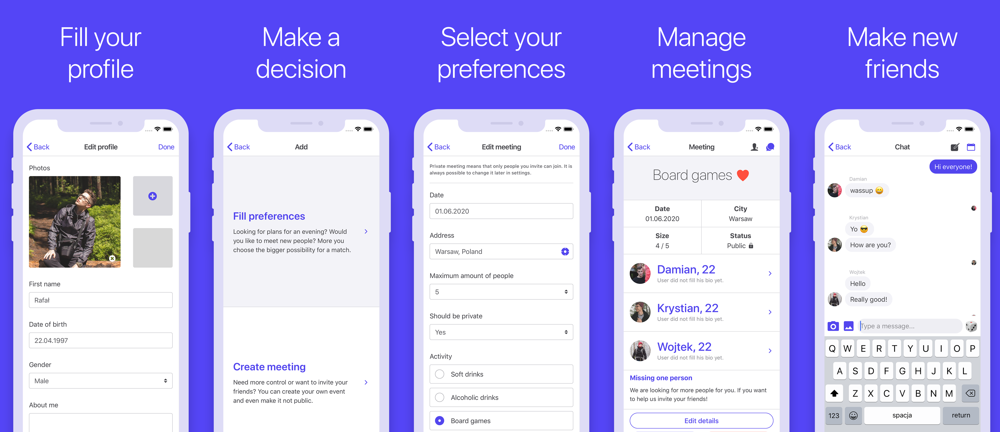
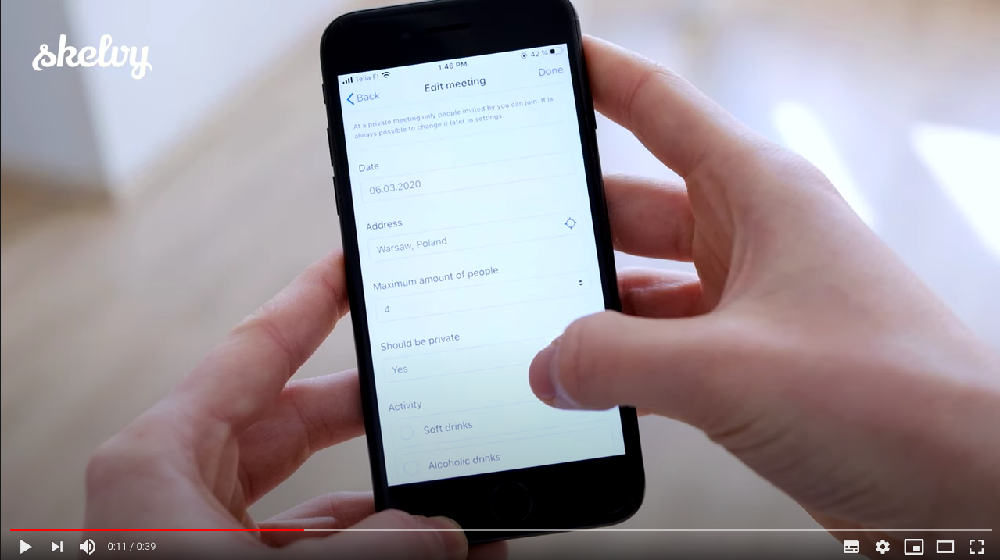

This repository is a part of **skelvy** project. It includes client for ios and android platforms.
Created with ionic and angular. Crafted with love to new technologies! 

There are other parts of the system which are located within different repositories:
- [Web API - ASP.NET Core 3](https://github.com/rafalschmidt97/skelvy-api)
- [Website - Wordpress](https://github.com/rafalschmidt97/skelvy-website)
- [Utilities - additional tools, graphics](https://github.com/rafalschmidt97/skelvy-utilities)

## Idea

The idea for Skelvy is extremely simple as it a tool for arranging and finding meetings over favourite activities in the city. Users log in to the app, fill in the meeting parameters with when, where and what they are planning or simply would like to do. Meetings always might be open to the public so other people in the area would see them in their explore tab.

## Tech stack

Typescript 3, Ionic 5 with Cordova for Android and iOS, Angular 8, linting and formatting with Prettier, Eslint and Stylelint, Bootstrap 4 (just a bit) with SCSS, all connections (API over HTTP and SignalR, Google Plus, Facebook, Push Notifications), CI with TravisCI, in app translations with ngx-translate, state with NGXS and Sqlite, PrimeNG.

The app is translated into 9 languages:
- Polish
- English
- German
- Spanish
- French
- Italian
- Russian
- Finnish

## Video introduction

- [English Youtube Video](https://youtu.be/_uS4fBgzgC4)
- [Polish Youtube Video](https://youtu.be/kRucIyZtuGA)

You can find more information within [solution description](docs/solution.md).

## Contributing guidelines

We really hope that good instructions for contributing will make the history of our app more readable. 
Take a look [here](CONTRIBUTING.md).

## Development

Current state of development is available to see on [trello](https://trello.com/b/MCzNyRJf).

## Stay in touch

* Website - [skelvy.com](https://skelvy.com/)
* Facebook - [skelvyapp](https://facebook.com/skelvyapp/)
* Twitter - [skelvyapp](https://twitter.com/skelvyapp/)
* Instagram - [skelvyapp](https://instagram.com/skelvyapp/)
* Email - [contact.skelvy@gmail.com](mailto:contact.skelvy@gmail.com)
